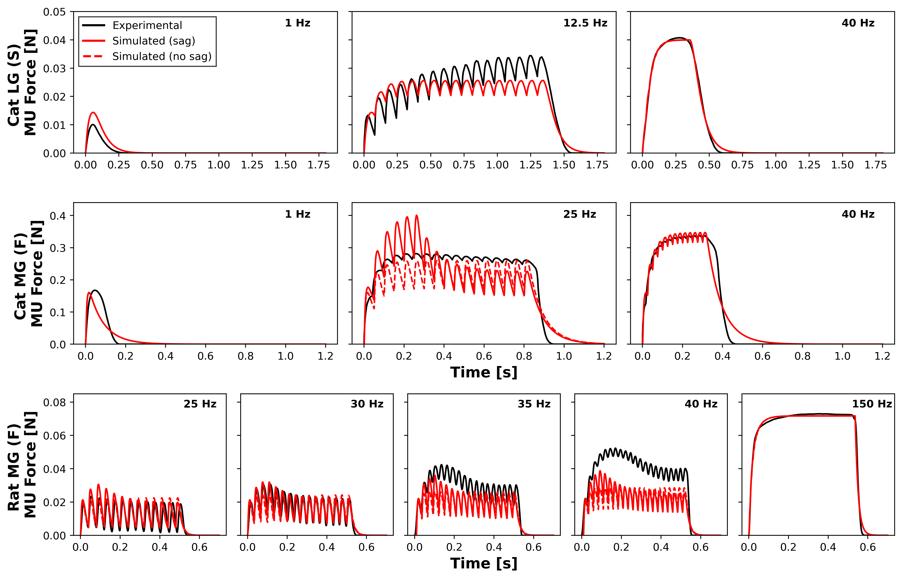
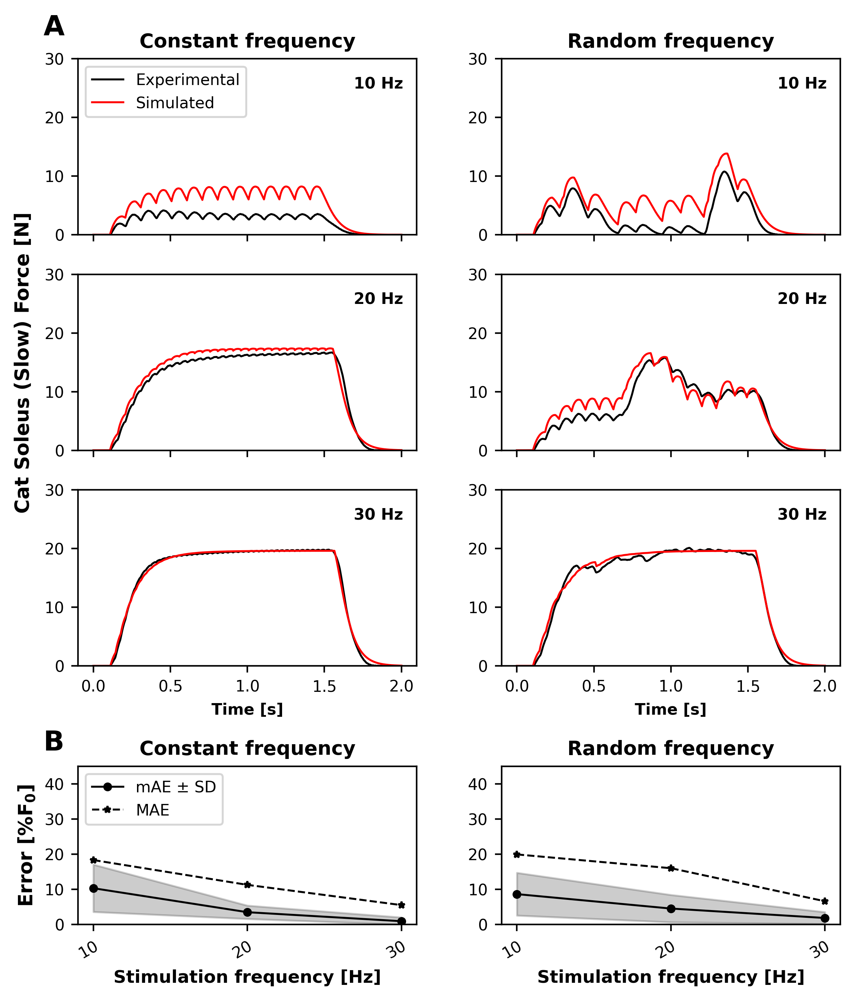
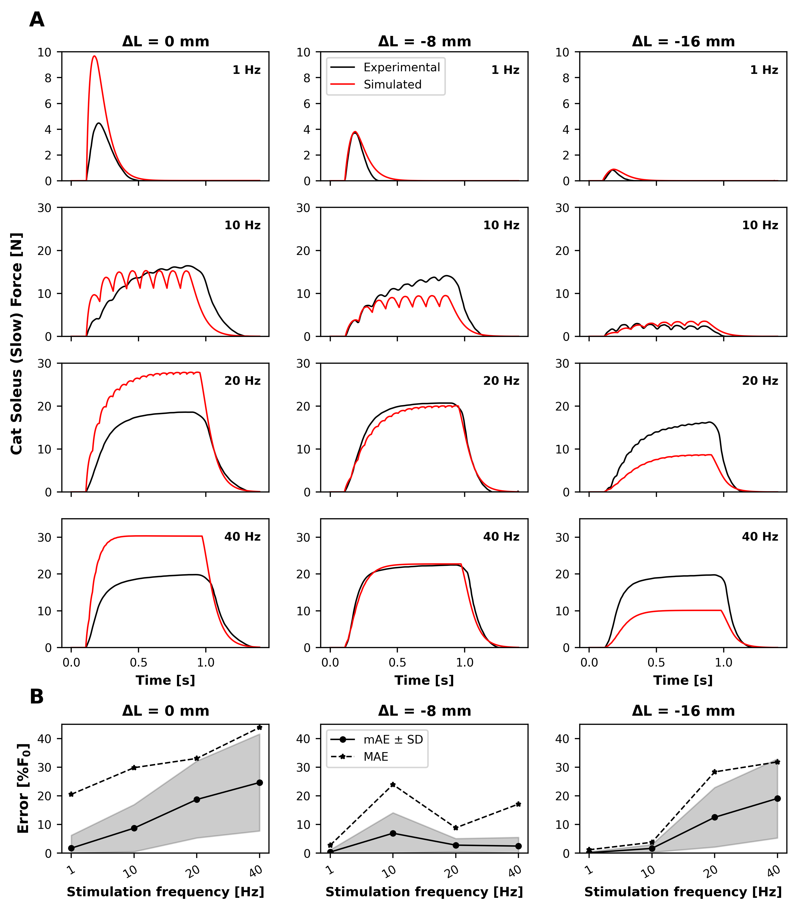
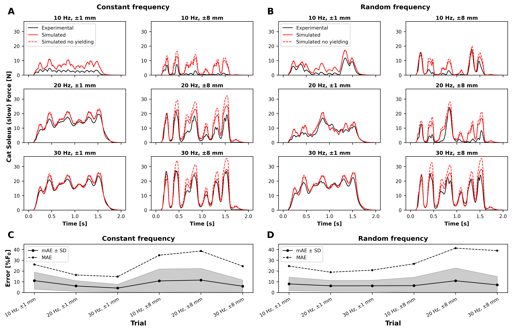
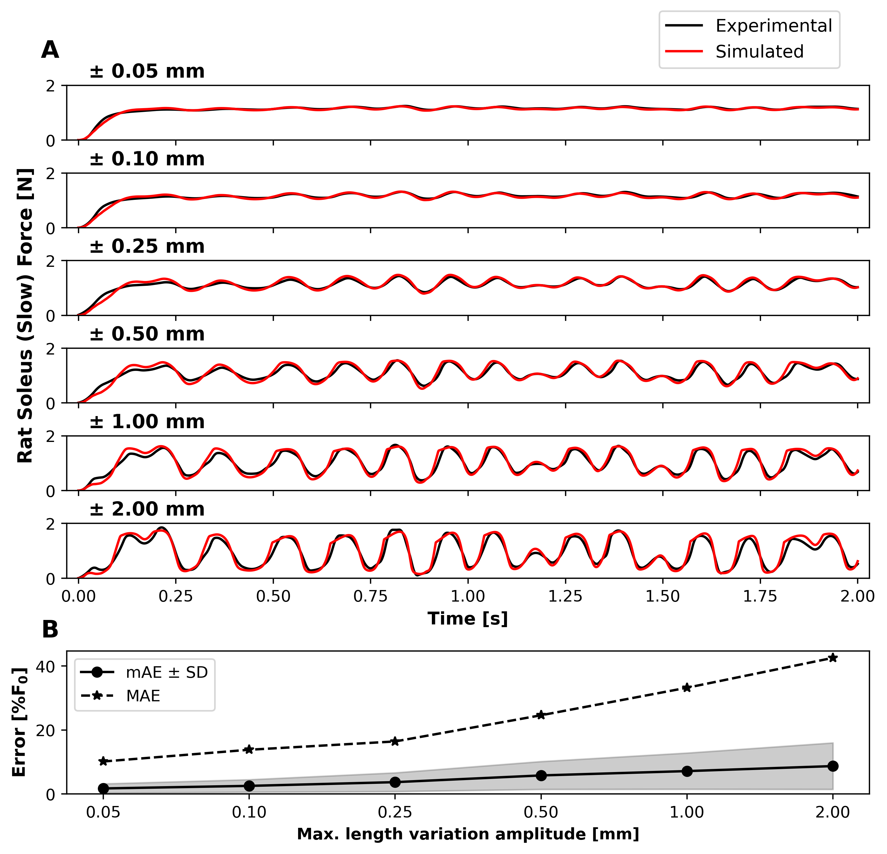
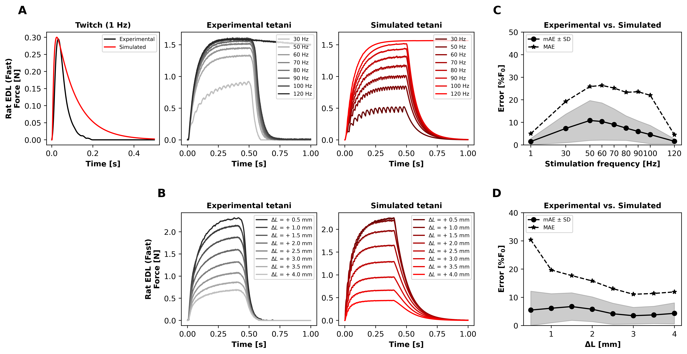
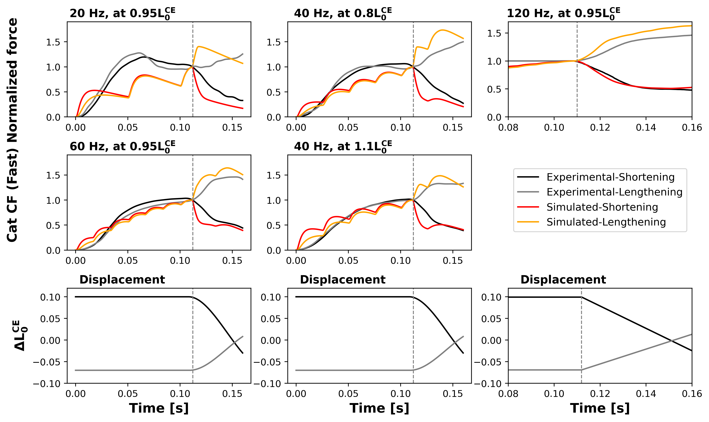

# Muscle Model Benchmarks

Code and benchmark data for validating a multiscale, fibre-type-specific Hill-type neuromuscular actuator against experimental motor-unit and whole-muscle force measurements.

This repository accompanies the manuscript:

**Validation of a multiscale Hill-type actuator against comprehensive benchmarks of motor unit and muscle force measurements**  
Andrea Sgarzi, Arnault H. Caillet, Matthew Millard, Sven Weidner, Nicos Haralabidis, Theo Meranger, Bart Bolsterlee, Dario Farina, Nigel H. Lovell, Luca Modenese

The model represents excitation, calcium-mediated activation, and contraction dynamics at both the motor-unit and whole-muscle scales. It is tested against slow and fast muscles, isometric and dynamic contractions, and motor-unit force traces.

## Repository Contents

```text
.
├── benchmark_Data/          # Raw or digitized benchmark input data
├── benchmark_Figures/       # Paper and benchmark summary figures
├── benchmark_Results/       # Saved experimental/simulated traces used for plots
├── benchmark_Model.py       # Multiscale Hill-type actuator implementation
├── benchmark_trials.py      # Benchmark trial definitions and parameters
├── run_benchmark.py         # Run, optimise, plot, and save individual trials
├── benchmark_Res_Plots.py   # Recreate paper summary plots and error metrics
├── plot_relationships.py    # Plot constitutive model relationships
├── requirements.txt         # Python dependencies
└── requirements.txt         # Python dependencies
```

## Installation

Create a Python environment and install the dependencies:

```bash
python -m venv venv
source venv/bin/activate      # Windows: .\venv\Scripts\activate
pip install -r requirements.txt
```

The code was developed with NumPy, SciPy, Matplotlib, Pandas, and Pillow. See `requirements.txt` for pinned package versions.

## Running Benchmarks

List available individual trials:

```bash
python run_benchmark.py --list
```

Run one trial:

```bash
python run_benchmark.py rat_SOL_0.05mm --save
```

The `--save` flag writes simulated and experimental arrays into `benchmark_Results/`, which are then used by the summary plotting script.

## Recreating Summary Figures

Run one benchmark summary:

```bash
python benchmark_Res_Plots.py fast_iso
python benchmark_Res_Plots.py slow_dyn2
python benchmark_Res_Plots.py MU
```

Run all summary benchmarks:

```bash
python benchmark_Res_Plots.py all
```

Available summary benchmark names:

```text
slow_dyn2
slow_isof_dyn1
slow_isol
MU
fast_iso
fast_dyn
Ca_transients
```

## Benchmark Datasets

### Motor-Unit Benchmarks

Motor-unit benchmarks test the model at the single-MU scale under isometric stimulation. They include slow and fast motor units from cat and rat gastrocnemius muscles.



Data sources include Burke et al. for cat motor-unit physiology and Celichowski et al. for rat/cat motor-unit tetani. The benchmark summary compares experimental and simulated twitch, unfused tetanic, and fused tetanic responses, including simulations with and without sag for fast units.

### Slow Muscle Benchmarks

Slow-muscle benchmarks include cat and rat soleus experiments under isometric and dynamic conditions.



The `slow_isof` and `slow_dyn1` data are derived from the OpenSim Muscle benchmark resources associated with Millard et al. (2013), originally based on Perreault et al. (2003). These trials test constant and random stimulation patterns at 10, 20, and 30 Hz.



The `slow_isol` benchmark tests force-length behaviour at different fixed muscle lengths and stimulation frequencies. These traces are based on the slow-muscle activation dynamics benchmark of Kim et al. (2015), building on the Perreault/Sandercock experimental framework.



The `slow_dyn1` benchmark evaluates submaximal dynamic responses to imposed length changes, including the effect of yielding.



The `slow_dyn2` data are derived from the OpenSim Muscle benchmark resources associated with Millard et al. (2013), originally based on Krylow and Sandercock (1997). These trials evaluate maximal rat soleus responses to imposed length variations.

### Fast Muscle Benchmarks

Fast-muscle benchmarks include rat extensor digitorum longus (EDL) and cat caudofemoralis (CF) data.



The `fast_isof` and `fast_isol` benchmarks contain rat EDL in vitro experiments performed for the associated study. They test force-frequency and force-length behaviour across twitch, unfused, and fused tetanic conditions.



The `fast_dyn` benchmark uses cat caudofemoralis dynamic force data from Brown, Cheng, and Loeb (1999), testing shortening and lengthening contractions under submaximal and maximal stimulation.

### Calcium Transient Benchmarks

The calcium-transient benchmarks compare simulated sarcoplasmic calcium concentration dynamics against digitized experimental data for slow and fast fibres. These data are based on Baylor/Hollingworth-style calcium measurements and later mouse-fibre calcium transient datasets used in the manuscript.

Run:

```bash
python benchmark_Res_Plots.py Ca_transients
```

## Data Provenance

The benchmark folders are organized by physiological scale:

```text
benchmark_Data/
├── Ca_transients/
├── MU/
└── Muscle/

benchmark_Results/
├── Ca_transients/
├── MU/
└── Muscle/
```

Important source notes:

- `slow_isof`, `slow_dyn1`, and `slow_dyn2` were obtained from the OpenSim Muscle benchmark resources hosted at <https://simtk.org/projects/opensim_muscle>, associated with Millard et al. (2013).
- `slow_isof` and `slow_dyn1` trace back to Perreault et al. (2003).
- `slow_dyn2` traces back to Krylow and Sandercock (1997).
- `slow_isol` follows Kim et al. (2015), based on the Perreault/Sandercock slow soleus benchmark context.
- `fast_dyn` uses Brown, Cheng, and Loeb (1999).
- `MU` benchmarks use motor-unit data from Burke et al. and Celichowski et al.
- `Ca_transients` uses digitized calcium transient data from Baylor/Hollingworth and Rincon/Calderon-related datasets as described in the manuscript.

## Notes for Public Release

The current `.gitignore` excludes `*.npy` files. If this repository is intended to be fully reproducible from GitHub alone, either:

- remove the `*.npy` rule and explicitly include `benchmark_Data/` and `benchmark_Results/`, or
- provide the `.npy` data through an external archive such as Zenodo, OSF, or Figshare and link it here.

Without these arrays, the plotting scripts and saved-result reproduction steps will not run from a fresh clone.

## Main References

- Millard, M., Uchida, T., Seth, A., & Delp, S. L. (2013). Flexing computational muscle: modeling and simulation of musculotendon dynamics. *Journal of Biomechanical Engineering*, 135(2), 021005. <https://doi.org/10.1115/1.4023390>
- Perreault, E. J., Heckman, C. J., & Sandercock, T. G. (2003). Hill muscle model errors during movement are greatest within the physiologically relevant range of motor unit firing rates. *Journal of Biomechanics*, 36(2), 211-218. <https://doi.org/10.1016/S0021-9290(02)00332-9>
- Krylow, A. M., & Sandercock, T. G. (1997). Dynamic force responses of muscle involving eccentric contraction. *Journal of Biomechanics*, 30(1), 27-33. <https://doi.org/10.1016/S0021-9290(96)00097-8>
- Kim, H., Sandercock, T. G., & Heckman, C. J. (2015). An action potential-driven model of soleus muscle activation dynamics for locomotor-like movements. *Journal of Neural Engineering*, 12(4), 046025. <https://doi.org/10.1088/1741-2560/12/4/046025>
- Brown, I. E., Cheng, E. J., & Loeb, G. E. (1999). Measured and modeled properties of mammalian skeletal muscle. II. The effects of stimulus frequency on force-length and force-velocity relationships. *Journal of Muscle Research and Cell Motility*, 20(7), 627-643. <https://doi.org/10.1023/A:1005585030764>
- Burke, R. E., Levine, D. N., Tsairis, P., & Zajac, F. E. (1973). Physiological types and histochemical profiles in motor units of the cat gastrocnemius. *Journal of Physiology*, 234(3), 723-748. <https://doi.org/10.1113/jphysiol.1973.sp010369>
- Celichowski, J., Grottel, K., & Bichler, E. (1999). Differences in the profile of unfused tetani of fast motor units with respect to their resistance to fatigue in the rat medial gastrocnemius muscle. *Journal of Muscle Research and Cell Motility*, 20(7), 681-685. <https://doi.org/10.1023/A:1005541013209>
- Hollingworth, S., Zhao, M., & Baylor, S. M. (1996). The amplitude and time course of the myoplasmic free calcium transient in fast-twitch fibers of mouse muscle. *Journal of General Physiology*, 108(5), 455-469. <https://doi.org/10.1085/jgp.108.5.455>
- Rincon, O. A., Milan, A. F., Calderon, J. C., & Giraldo, M. A. (2021). Comprehensive simulation of Ca2+ transients in the continuum of mouse skeletal muscle fiber types. *International Journal of Molecular Sciences*, 22(22), 12378. <https://doi.org/10.3390/ijms222212378>

## Citation

If you use this code or benchmark dataset, please cite the associated manuscript once published. Until publication, cite this repository together with the relevant source datasets listed above.
